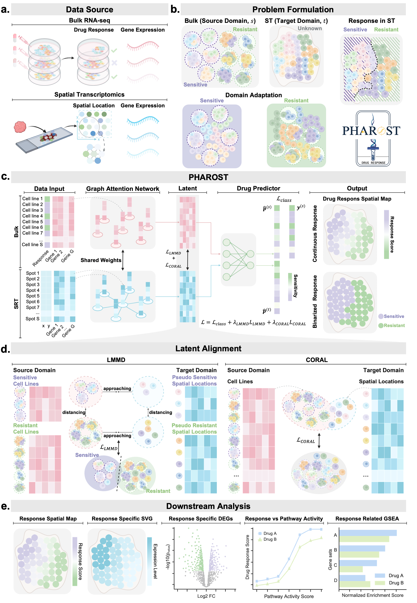

PHAROST Documentation
=====================

PHAROST is a deep transfer learning framework for pharmacogenomic outcome prediction in spatial transcriptomics.

---

Getting Started
---------------

.. toctree::
   :maxdepth: 2

   installation
   quickstart

---

User Guide
----------

.. toctree::
   :maxdepth: 2

   tutorial
   data

---

API Reference
-------------

.. toctree::
   :maxdepth: 2

   api

---

Citation
--------

.. toctree::
   :maxdepth: 1

   citation